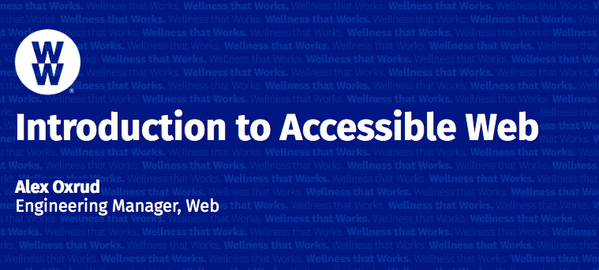

## Girls Who Code 2021 
The following are the assets used to present at Girls Who Code.

### Presentation
The presentation can be found:
- [PDF](./Girls%20Who%20Code%20-%20Accessible%20Web%202021.pdf)
- [Powerpoint w/ Speaker Notes](./Girls%20Who%20Code%20-%20Accessible%20Web%202021.pdf)

### Examples 

- [accessible website example](/better-accessibility-example.html) 
  - It uses semantic elements where appropriate
  - All images have `alt` texts
  - Headlines and links are using semantic elements

- [not very accessible website example](/minimal-accessibility-example.html) 
  - It uses `
` elements instead of semantic elements.
  - No images have `alt` texts
  - There are no semantic headlines or semantic links.

### Looking for more?

Check out my [Web Accessibility Tips and Tricks repo](https://github.com/aoxrud-ww/web-accessibility-tips)
  
